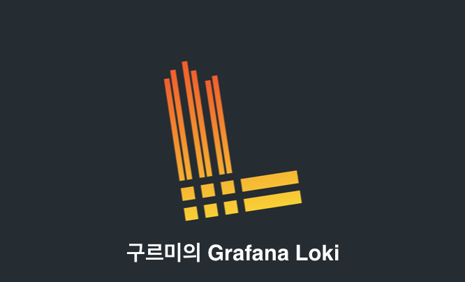

# 로키란 무엇인가?

## 로키란 무엇인가

`Grafana Loki`는 `Grafna Labs`에서 만든 로깅 시스템입니다. 기존 로깅 시스템과 달리, "로그에 대한 메타 데이터만 인덱싱한다"라는 아이디어 기반으로 구축 되었습니다. 그 후 로그 데이터는 `Amazon S3`, `GCS(Google Cloud Storage)` 같은 `Object Store` 혹은 로컬 파일 시스템에 압축되어 청크로 저장됩니다. `Grafana Loki`는 작은 인덱스와 고도로 압축된 청크를 통해 작업을 단순화하여 비용이 적다는 것이 큰 특징입니다.

개요

`Grafana Loki`는 로그 집계 도구이며, 완전한 기능을 갖춘 로깅 스택입니다. 로키는 로그 데이터를 효과적으로 처리할 수 있는 최적화된 데이터 저장소입니다. 로그 데이터의 효울적인 인덱싱은 다른 로킹 시스템들과 차별되는 부분 중 하나입니다. 다른 로킹 시스템과 달리 로키의 인덱싱은 레이블을 통해 구성되며, 로그 메세지 원본은 인덱싱되지 않습니다. (ES의 경우 역인덱싱 구조이다.)

에이전트는 로그를 수집하고 수집된 로그를 스트림으로 바꿔 그 스트림을 로키의 HTTP API를 통해 푸쉬합니다. Grafana Labs에서 만든 Promtail이라는 로키 전용 에이전트가 있으며, 다른 에이전트(fluent-bit, fluentd 등의)들 역시 로키를 통해 로그를 수집할 수 있습니다.

로키는 스트림을 인덱스합니다. 각 스트림은 유니크한 레이블 세트와 연관된 로그 세트를 식별합니다. 레이블 세트의 품질이 압축 및 효울적인 쿼리 실행을 할 수 있는 인덱스를 만드는 중요한 키입니다.

LogQL은 로키의 쿼리 언어입니다.

로키 특징

* 로그 인덱싱을 위한 효율적인 메모리 사용
  레이블 세트를 인덱싱 함으로써, 그 인덱스는 다른 로그 집계 솔루션과 달리 충분히 더 작아질 수 있습니다. 더 적은 메모리의 사용은 연산 시 더 적은 비용을 만들어냅니다.
* 멀티 테넌시 지원
  로키는 단일 인스턴스에서 멀티 테넌트를 지원합니다. 데이터는 테넌트로 구분되며, 다른 테넌트와 완전히 격리됩니다. 멀티 테넌시는 에이전트에서 테넌트 ID를 할당하여 구성합니다.
* LogQL 로키 쿼리 언어
  Prometheus 쿼리 언어인 PromQL 사용해봤다면 LogQL이 로그에 대한 쿼리 생성에 익숙하고 유연하다는 것을 느낄 수 있습니다. 이 쿼리 언어는 또한, 로그 데이터에서 메트릭 데이터를 생성할 수 있는 강력한 로그 집계 기능을 지원합니다.
* 확장성
  로키는 하나의 프로세스의 모든 컴포넌트가 실행될 수 있는 단일 바이너리로 실행될 수 있습니다. 로키는 확장성을 위해 설계되었고 각 컴포넌트들은 마이크로서비스로써 실행할 수 있습니다. 설정을 통해 각 컴포넌트들을 개별적으로 확장할 수 있으므로 유연하게 대규모 클러스터를 구성할 수 있습니다.
* 유연성
  많은 에이전트들을 위한 플러그인이 지원됩니다. 이를 통해서 observability stack에서 기존 로그 집계 도구를 제거할 필요 없이 로키를 추가할 수 있습니다.
* 그라파나와 통합
  로키는 그라파나와 원활하게 통합되어 완전한 observability stack을 제공합니다.

## 왜 로키인가

## 로키 아키텍처 (1) 컴포넌트

## 로키 아키텍처 (2) 데이터 포맷

## 로키 설치